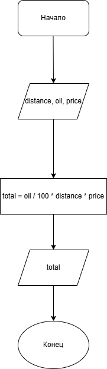

# Домашнее задание к работе 3

## Условие задачи
Написать и отладить программу стоимости поездки, исходя из известного расстояния и стоимости бензина.

## 1. Алгоритм и блок-схема

### Алгоритм
1. **Начало**
2. Задать исходные данные:
   - `distance` — расстояние, которое необходимо проехать (км).
   - `oil` — расход топлива (л/100км).
   - `price` - цена бензина (р/л).
3. Вычислить стоимость поездки:
   - `total` = `oil` / 100 * distance * price 
5. Вывести результаты расчетов с подстановкой всех значений в текст.
6. **Конец**

### Блок-схема
 

## 2. Реализация программы
```
#include <stdio.h>
#include <locale.h>
void main()
{
	setlocale(LC_ALL, "RUS");
	int distance;
	float oil;
	float price;
	float total;
	puts("Введите расстояние в км:");
	scanf_s("%d", &distance);
	puts("Введите расход топлива:");
	scanf_s("%f", &oil);
	puts("Введите стоимость топлива за 1л:");
	scanf_s("%f", &price);
	total = oil / 100 * distance * price;
	printf("Стоимость поездки составит: %.2f рублей", total);
}
```
## 3. Результаты работы программы

Введите расстояние в км:
100
Введите расход топлива:
1
Введите стоимость топлива за 1л:
50
Стоимость поездки составит: 50,00 рублей

## 4. Информация о разработчике

Калашников Дмитрий бИПТ-251
